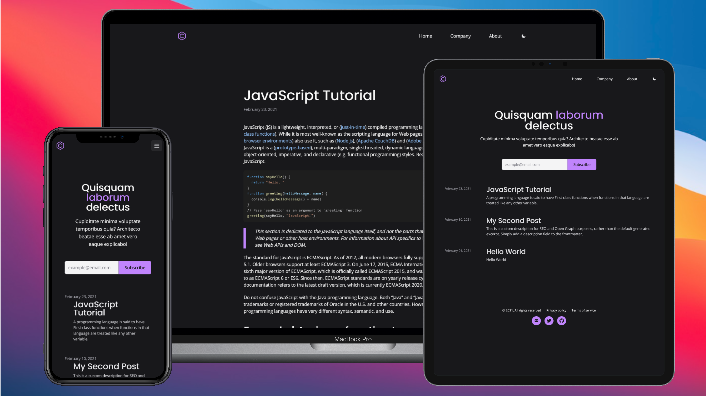
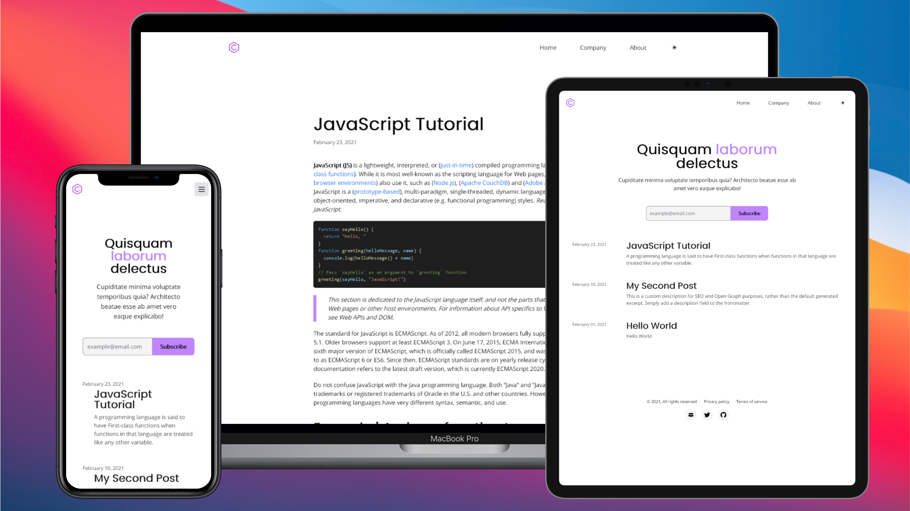

# [Gatsby/TailwindCSS] Gatsby Markdown Blog Theme build with TailwindCSS

> Website deployed at Vercel -> [https://gatsbyjs-tailwindcss-blog.vercel.app](https://gatsbyjs-tailwindcss-blog.vercel.app/)

---




---

## 🚀 Quick start

1.  **Clone this repo or simple download it.**

    Clone the master branch of this repo:

    ```shell
    # clone master repo
    git clone -b https://github.com/clovis-rosa/gatsbyjs-tailwindcss-blog.git
    ```

2.  **Start developing.**

    Navigate into your new site’s directory and start it up.

    ```shell
    # navigate to the project folder
    cd gatsbyjs-tailwindcss-blog/
    ```

    Install the dependencies

    ```shell
    yarn install
    # or
    npm install
    ```

    Open the source code and start editing!

    ```shell
    code .
    gatsby develop
    ```

    Your site is now running at `http://localhost:8000`!

## 🧐 What's inside?

A quick look at the dependencies amd resources:

- Bootstrapped with [Gatsby](www.gatsbyjs.com).
- Styled with [TailwindCSS](https://tailwindcss.com/)
- gatsby-plugin-web-font-loader [Gatsby plugin](https://www.gatsbyjs.com/plugins/gatsby-plugin-web-font-loader/)

## 🎓 Learning Gatsby

Looking for more guidance? Full documentation for Gatsby lives [on the website](https://www.gatsbyjs.com/).

Here are some places to start:

### Themes

- To learn more about Gatsby themes specifically, we recommend checking out the [theme docs](https://www.gatsbyjs.com/docs/themes/).

## 💫 Deploying

- I recommend to use either [Vercel](https://vercel.com) or [Netlify](https://netlify.com) for hosting your site.

### Resources

- [Mamba UI - free TailwindCSS components and templates](https://mambaui.com/)
- [Error: Can't resolve 'remark' in '/vercel/workpath0/lib](https://github.com/vercel/next.js/discussions/18176)
- [How to Dark Mode in React and TailwindCSS](https://jeffjadulco.com/blog/dark-mode-react-tailwind/)
- [Previewed - Create Awesome Mockups](https://previewed.app/mockup/maker/)

## 📖 License

- This project is licensed under [the terms of the 0BSD license](LICENSE).
